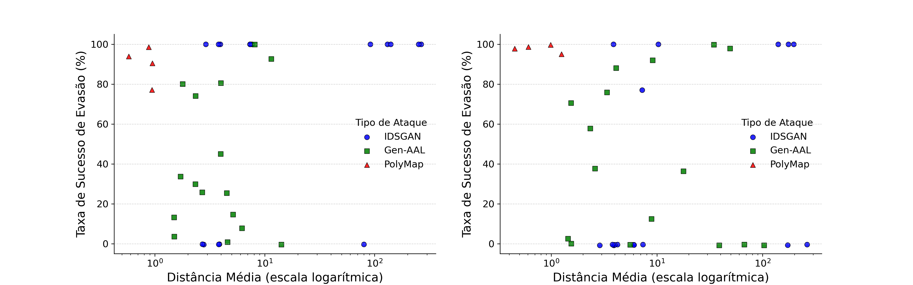
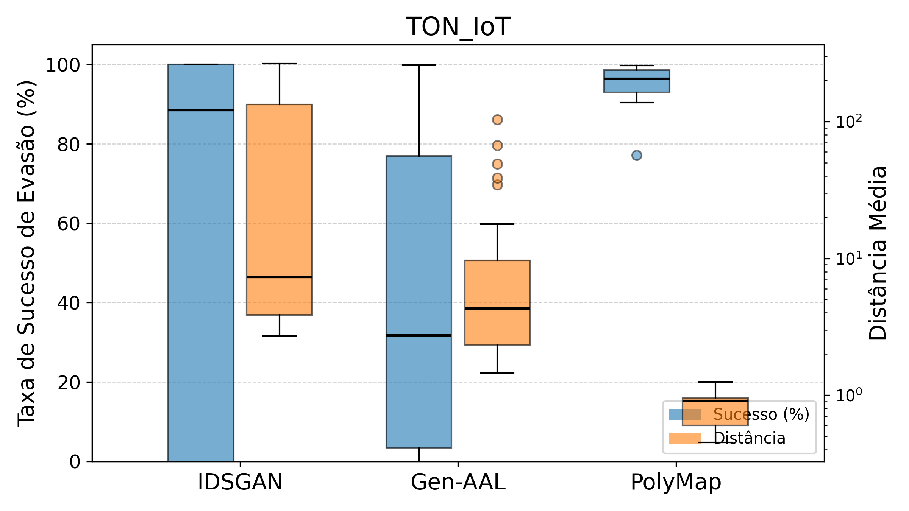
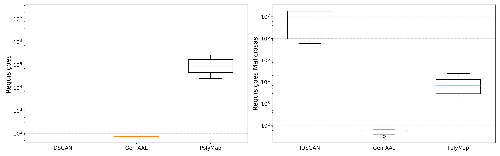

# PolyMap

Este repositório engloba o código e resultados experimentais utilizados para a escrita do artigo "Evasão em Modelos de Detecção de Ameaças de Rede Usando Propriedades do Espaço de Decisão", aceito para publicação na 44ª edição do Simpósio Brasileiro de Redes de Computadores e Sistemas Distribuídos (SBRC 2026).

O PolyMap consiste em um método para evasão em sistemas de detecção de ameaças de redes a partir do mapeamento do espaço de decisão do modelo de classificação como um conjunto de politopos convexos.
Inicialmente, é realizado um mapeamento do espaço de decisão do modelo alvo utilizando uma amostra de tráfego normal como base e a modificando até que ela seja classificada como tráfego malicioso.
Esse processo é repetido para diversas amostras de tráfego normal, e o espaço encontrado é representado como um conjunto de politopos.
Durante a realização de um ataque de rede, amostras de tráfego malicioso podem ser modificadas para que elas estejam dentro de um dos politopos encontrados, buscando minimizar a distância entre a amostra original e a adversarial.

# Estrutura do readme.md

Os arquivos `*.ipynb` na raíz do repositório foram utilizados para execução e avaliação dos diferentes métodos de ataque e, posteriormente, para analisar os resultados e desenhar gráficos.

A implementação dos modelos de classificação de tráfego de rede e dos métodos de ataque podem ser econtrados na pasta `utils`.

A pasta `dataset` deve ser preenchida com os datasets utilizados para treinamento dos modelos de classificação.

A pasta `snapshots` é preenchida automaticamente com os estados dos modelos de detecção treinados ao executar os códigos.

Os resultados obtidos para os modelos de detecção e métodos de ataque podem ser encontrados na pasta `results`.

# Selos Considerados

Para estes artefatos, são considerados os seguintes selos, com base nos códigos e resultados apresentados:

- Artefatos Disponíveis (SeloD)

# Informações básicas

Os códigos contidos neste repositório foram desenvolvidos em Python, com o auxílio de bibliotecas de terceiros. A seção a seguir descreve as dependências necessárias para configurar e executar os experimentos.

# Dependências

A seguir, são listadas as dependências necessárias para a execução do PolyMap.

## Software

- Sistema operacional Linux (execução não foi verificada em sistemas Windows ou MacOS).
- Git
- Python 3 (utilizada versão 3.14.3).
- Python Pip
- Jupyter Notebook
- Instalação de bibliotecas disponíveis no arquivo `requirements.txt`

## Hardware

### Execução dos experimentos

- CPU: Mínimo 4 núcleos.
- RAM: 16GB (execução parcial) ou 40GB para execução de todos os experimentos em todos os datasets.
- Armazenamento: 50GB para execução de todos os experimentos em todos os datasets.
- Placa de Vídeo: Recomendado placa de vídeo com suporte a CUDA e pelo menos 6GB de VRAM para execução de todos os experimentos.

### Análise dos resultados

- Sistema operacional Linux (execução não foi verificada em sistemas Windows ou MacOS).
- CPU: Sem restrição.
- RAM: 4GB.
- Armazenamento: 5GB.

# Preocupações com segurança

- Uso de bibliotecas de terceiros: O código apresentado faz uso de bibliotecas terceiras obtidas pelo gerenciador de pacotes do python (pip) e pelo site externo do PyTorch. Apesar de terem sido escolhidas apenas bibliotecas de ampla utilização e boa reputação, existem riscos intrínsicos da utilização de códigos de terceiros.

# Instalação

Esta seção descreve o processo de obtenção do repositório, instalação de dependências e configuração.
Inicialmente, verifique se as dependências listadas na seção [Dependências](#dependências) estão corretamente instaladas.

Em seguida, clone o repostirório:

```
git clone https://github.com/RafaelDiasCampos/PolyMap-SBRC
cd PolyMap-SBRC
```

Em seguida, instale as dependências:

```
# Criação e ativação do venv
python3 -m venv .venv
source .venv/bin/activate

# Instalação das depêndencias
pip3 install -r requirements.txt
pip3 install torch torchvision
```

# Teste mínimo

Após instalar e configurar as dependências, o notebook Python `3 - Plotting results.ipynb` pode ser executado para validar o funcionamento das bibliotecas instaladas.

# Experimentos

A realização dos experimentos completos exige altos recursos computacionais e um tempo elevado de execução de múltiplos dias.
Dessa forma, também oferecemos uma versão reduzida que permite executar experimentos em aproximadamente 5-6 horas no dataset TON_IoT, utilizando uma fração de 30% de seus dados e com apenas 3 repetições (ao invés de 7).
Nesta seção, descrevemos o processo de executar esses experimentos.

## Versão reduzida

Para executar a versão reduzida dos experimentos, execute o script automatizado:

```
./scripts/execute_experiments_reduced.sh
```

Os arquivos necessários do dataset TON-IoT já estão incluso nesse repositório, e portanto não necessitam de download separado.
Os resultados obtidos serão salvos na pasta `results` e podem ser visualizados para análise.

## Reivindicação #1: Maior estabilidade dos resultados obtidos com o PolyMap

Após executar a versão reduzida (ou completa) dos experimentos, devem ser obtidos resultados na pasta `results` que indicam a maior estabilidade do PolyMap em comparação com os métodos comparados IDSGAN e Gen-AAL.
Em especial, o arquivo `results/attack_results_ton_iot.png` deve demonstrar que as execuções do PolyMap apresentam menor variação em seus resultados.
Resultados similares devem ser observados caso seja feita a execução da versão completa dos experimentos, com gráficos adicionais nos arquivos `results/attack_results_bot_iot.png`, `results/attack_results_ctu_13.png` e `results/attack_results_nsl_kdd.png`, referentes aos demais datasets.



## Reivindicação #2: PolyMap obtém uma taxa de sucesso de evasão similar e uma distância média menor aos outros métodos.

Após a execução dos experimentos, o arquivo `results/attack_results.png` deve demonstrar uma taxa de sucesso similar obtida pelo PolyMap em comparação ao IDSGAN e Gen-AAL.
Ao mesmo tempo, a distância média obtida foi inferior à obtida pelos demais métodos.
Resultados similares devem ser observados caso seja feita a execução da versão completa dos experimentos, com subgráficos adicionais para os demais datasets utilizados.



## Reivindicação #3: PolyMap envia um número de amostras para classificação entre a quantidade enviada pelos demais métodos.

Após a execução dos experimentos, o arquivo `results/query_stats_boxplots.png` deve demonstrar que, durante a etapa de treinamento dos métodos de ataque, PolyMap envia um número de requisições inferior ao IDSGAN mas superior ao Gen-AAL.
Resultados similares devem ser observados caso seja feita a execução da versão completa dos experimentos.



## Versão completa

A realização dos experimentos completos consiste em múltiplas etapas.
Primeiramente, deve ser feito o treinamento dos modelos de detecção de ameaças de rede.
Em seguida, devem ser realizados os ataques nos modelos treinados.
Por fim, os resultados obtidos podem ser analisados e os gráficos gerados.
As seções a seguir descrevem a execução de cada etapa dos experimentos.

### Obtenção dos datasets

Para obter os datasets, execute o script criado e siga as instruções para fazer download dos arquivos e copiá-los para as pastas.
Esse processo realiza o download automatizado do dataset CTU-13, mas requer download manual de arquivos referentes aos datasets Bot-IoT e NSL-KDD, conforme instruções exibidas na tela.

```
./scripts/get_datasets.sh
```

Após realizar o download dos arquivos, é realizada uma validação de seus checksums para garantir a ausência de erros durante esse processo.

### Configuração dos parâmetros

Este repositório está configurado com os parâmetros utilizados durante a execução dos experimentos para a escrita do artigo.
Na configuração padrão, são criados e treinados 8 modelos FNN e 8 modelos SNN para a classificação de tráfego de rede para cada dataset, representando um total de 64 modelos.
Em seguida, para cada modelo treinado são executados os ataques Gen-AAL e IDSGAN 5 vezes, e o ataque PolyMap 1 vez, para comparação de resultados.
Esse processo demora um tempo significativo de execução de múltiplos dias devido à grande quantidade de dados em cada dataset e de repetições de cada experimento.

Caso seja desejável reduzir a quantidade de repetições dos experimentos, podem ser alterados os parâmetros `n_copies` e `n_trials` no arquivo `utils/parameters.py`.

### Treinamento dos modelos de decisão

Para treinar os modelos de decisão, pode ser executado o notebook Python `1 - Training classification models.ipynb`.
Os resultados obtidos são exibidos no notebook e armazenados no arquivo `results\classification_results.json`.

### Execução dos ataques

Após treinar os modelos de detecção, o notebook python `2 - Executing attack strategies.ipynb` pode ser executado para executar os métodos de ataque em cada modelo de detecção treinado anteriormente.
Os resultados obtidos são exibidos no notebook e armazenados no arquivo `results\attack_results.json`.

### Análise dos resultados

Depois de executar os ataques, o notebook `3 - Plotting results.ipynb` pode ser utilizado para gerar gráficos indicando as métricas obtidas por cada ataque contra os modelos de detecção.
Os gráficos gerados são exibidos no notebook e salvos na pasta `results`.

# LICENSE

Este projeto está licenciado sob a licença MIT. Consulte o arquivo [LICENSE](LICENSE) para mais detalhes.