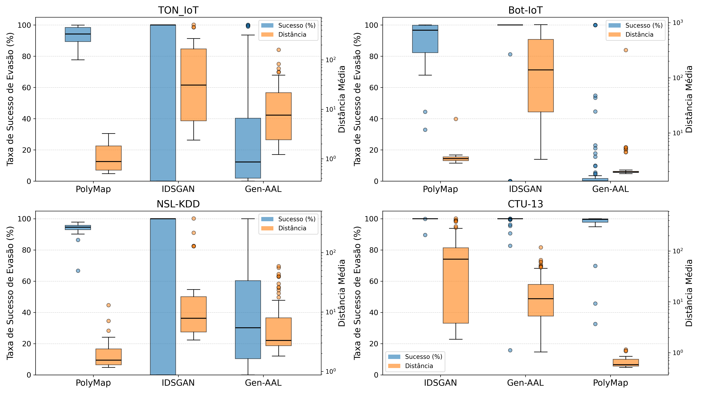
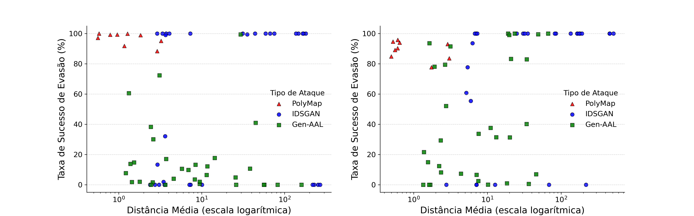
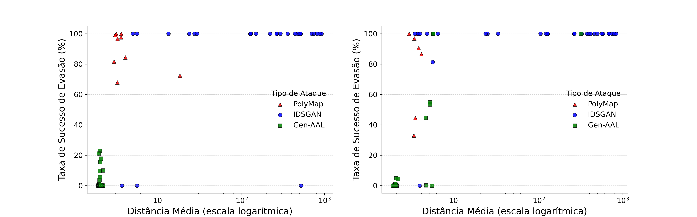
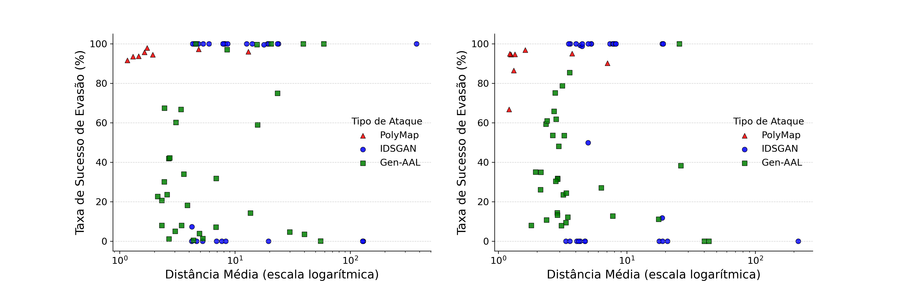
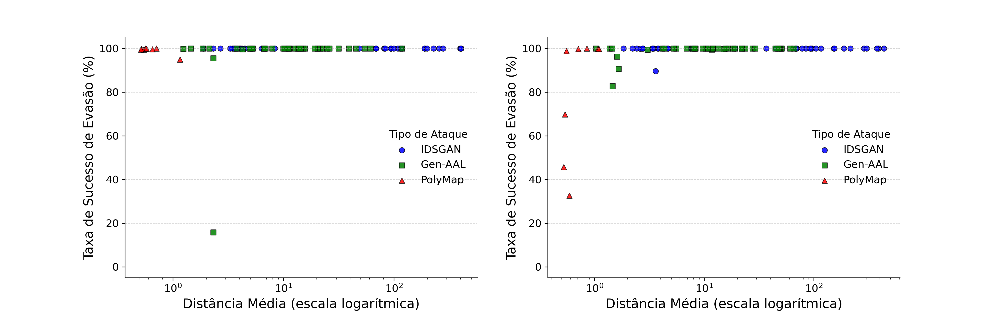

# PolyMap

Este repositório engloba o código e resultados experimentais utilizados para a escrita do artigo "Evasão em Modelos de Detecção de Ameaças de Rede Usando Propriedades do Espaço de Decisão", aceito para publicação na 44ª edição do Simpósio Brasileiro de Redes de Computadores e Sistemas Distribuídos (SBRC 2026).

O PolyMap consiste em um método para evasão em sistemas de detecção de ameaças de redes a partir do mapeamento do espaço de decisão do modelo de classificação como um conjunto de politopos convexos.
Inicialmente, é realizado um mapeamento, amostras de tráfego malicioso podem ser modificadas para 

# Estrutura do repositório

Os arquivos `*.ipynb` na raíz do repositório foram utilizados para execução e avaliação dos diferentes métodos de ataque e, posteriormente, para analisar os resultados e desenhar gráficos.

A implementação dos modelos de classificação de tráfego de rede e dos métodos de ataque podem ser econtrados na pasta `utils`.

A pasta `dataset` deve ser preenchida com os datasets utilizados para treinamento dos modelos de classificação.

A pasta `snapshots` é preenchida automaticamente com os estados dos modelos de detecção treinados ao executar os códigos.

Os resultados obtidos para os modelos de detecção e métodos de ataque podem ser encontrados na pasta `results`.

# Selos Considerados

Para estes artefatos, são considerados os seguintes selos, com base nos códigos e resultados apresentados:

- Artefatos Disponíveis (SeloD)
- Artefatos Funcionais (SeloF)
- Artefatos Sustentáveis (SeloS)
- Experimentos Reprodutíveis (SeloR)

# Dependências

A seguir, são listadas as dependências necessárias para a execução do PolyMap.

## Software

- Git
- Python 3 (utilizada versão 3.14.3).
- Python Pip
- Jupyter Notebook
- Instalação de bibliotecas disponíveis no arquivo `requirements.txt`

## Hardware

### Execução dos experimentos

- Sistema operacional Linux (execução não foi verificada em sistemas Windows ou MacOS).
- CPU: Mínimo 4 núcleos.
- RAM: 40GB para execução de todos os experimentos em todos os datasets.
- Armazenamento: 50GB para execução de todos os experimentos em todos os datasets.
- Placa de Vídeo: Recomendado placa de vídeo com suporte a CUDA e pelo menos 6GB de VRAM para execução de todos os experimentos.

### Análise dos resultados

- Sistema operacional Linux (execução não foi verificada em sistemas Windows ou MacOS).
- CPU: Sem restrição.
- RAM: 4GB.
- Armazenamento: 5GB.

# Preocupações com segurança

- Uso de bibliotecas de terceiros: O código apresentado faz uso de bibliotecas terceiras obtidas pelo gerenciador de pacotes do python (pip) e pelo site externo do PyTorch. Apesar de terem sido escolhidas apenas bibliotecas de ampla utilização e boa reputação, existem riscos intrínsicos da utilização de códigos de terceiros.

# Instalação

Inicialmente, verifique se as dependências listadas na seção [Dependências](#dependências) estão corretamente instaladas.

Em seguida, clone o repostirório:

```
git clone https://github.com/RafaelDiasCampos/PolyMap-SBRC
``` 

Instale as dependências:

```
pip install -r requirements.txt
```

Pode ser necessário instalar manualmente o PyTorch, seguindo as instruções no endereço `https://pytorch.org/get-started/locally/`.

# Configuração

Após o processo de instalação, para executar os experimentos é necessário incluir os arquivos referentes aos datasets na pasta `dataset`, conforme a estrutura a seguir.
Caso apenas seja desejado analisar os resultados inclusos na pasta `results`, esta etapa pode ser ignorada.

- Bot-IoT: Adicionar arquivos `UNSW_2018_IoT_Botnet_Full5pc_1.csv`, `UNSW_2018_IoT_Botnet_Full5pc_2.csv`, `UNSW_2018_IoT_Botnet_Full5pc_3.csv` e `UNSW_2018_IoT_Botnet_Full5pc_4.csv` na pasta `dataset/bot_iot`. Eles podem ser obtidos pelo [link](https://unsw-my.sharepoint.com/personal/z5131399_ad_unsw_edu_au/_layouts/15/onedrive.aspx?id=%2Fpersonal%2Fz5131399%5Fad%5Funsw%5Fedu%5Fau%2FDocuments%2FBot%2DIoT%5FDataset%2FDataset%2F5%25%2FAll%20features&viewid=604d81f1%2D64a9%2D4a09%2D8464%2D3c45ff9ba8fe) no Onedrive disponibilizado pelos autores.
- TON_IoT: Adicionar arquivo `train_test_network.csv` na pasta `dataset/ton_iot`. Ele pode ser obtido pelo [link](https://unsw-my.sharepoint.com/personal/z5025758_ad_unsw_edu_au/_layouts/15/onedrive.aspx?id=%2Fpersonal%2Fz5025758%5Fad%5Funsw%5Fedu%5Fau%2FDocuments%2FTON%5FIoT%20datasets%2FTrain%5FTest%5Fdatasets%2FTrain%5FTest%5FNetwork%5Fdataset&viewid=f8d1dec5%2Dcd5f%2D42ae%2D8b06%2D2fece580c74a&startedResponseCatch=true) no Onedrive disponibilizado pelos autores.
- NSL-KDD: Adicionar arquivos `KDDTrain+.arff` e `KDDTest+.arff` na pasta `dataset/nsl-kdd`. Esse dataset não é mais disponibilizado oficialmente pelos autores, mas pode ser obtido pelo [link](https://www.kaggle.com/datasets/hassan06/nslkdd).
- CTU-13: Adicionar arquivos `capture20110818.binetflow.csv` e `capture20110818-2.binetflow.csv` na pasta `dataset/ctu-13`. Eles podem ser obtidos pelo [link](https://www.stratosphereips.org/datasets-ctu13) no Onedrive disponibilizado pelos autores, buscando pelos cenários 51 e 52.

Em seguida, é necessário remover os arquivos na pasta `results` que contém os resultados anteriores, para que eles sejam atualizados com os novos resultados.

# Teste mínimo

Após instalar e configurar as dependências, o notebook Python `3 - Plotting results.ipynb` pode ser executado para validar o funcionamento das bibliotecas instaladas.
Caso seja desejado executar os experimentos, é recomendável validar a instalação correta do PyTorch com aceleração gráfica, conforme instruções disponíveis em `https://pytorch.org/get-started/locally/`.

# Experimentos

A realização dos experimentos consiste em múltiplas etapas.
Primeiramente, deve ser feito o treinamento dos modelos de detecção de ameaças de rede.
Em seguida, devem ser realizados os ataques nos modelos treinados.
Por fim, os resultados obtidos podem ser analisados e os gráficos gerados.
As seções a seguir descrevem a execução de cada etapa dos experimentos.

## Configuração dos parâmetros

Este repositório está configurado com os parâmetros utilizados durante a execução dos experimentos para a escrita do artigo.
Na configuração padrão, são criados e treinados 8 modelos FNN e 8 modelos SNN para a classificação de tráfego de rede para cada dataset, representando um total de 64 modelos.
Em seguida, para cada modelo treinado são executados os ataques Gen-AAL e IDSGAN 5 vezes, e o ataque PolyMap 1 vez, para comparação de resultados.
Esse processo demora um tempo significativo de execução de múltiplos dias devido à grande quantidade de dados em cada dataset e de repetições de cada experimento.

Caso seja desejável reduzir a quantidade de repetições dos experimentos, podem ser alterados os parâmetros `n_copies` e `n_trials` no arquivo `utils/parameters.py`.

## Treinamento dos modelos de decisão

Para treinar os modelos de decisão, pode ser executado o notebook Python `1 - Training classification models.ipynb`.
Os resultados obtidos são exibidos no notebook e armazenados no arquivo `results\classification_results.json`.

## Execução dos ataques

Após treinar os modelos de detecção, o notebook python `2 - Executing attack strategies.ipynb` pode ser executado para executar os métodos de ataque em cada modelo de detecção treinado anteriormente.
Os resultados obtidos são exibidos no notebook e armazenados no arquivo `results\attack_results.json`.

## Análise dos resultados

Depois de executar os ataques, o notebook `3 - Plotting results.ipynb` pode ser utilizado para gerar gráficos indicando as métricas obtidas por cada ataque contra os modelos de detecção.
Os gráficos gerados são exibidos no notebook e salvos na pasta `results`.

# Resultados obtidos

Esta seção contém os resultados experimentais obtidos pela execução dos métodos de ataque.

## Taxa de sucesso e distância média obtidas em cada dataset


## Taxa de sucesso vs. distância média obtidas em cada execução do dataset TON_IoT em redes FNN (esquerda) e SNN (direita).


## Taxa de sucesso vs. distância média obtidas em cada execução do dataset Bot-IoT em redes FNN (esquerda) e SNN (direita).


## Taxa de sucesso vs. distância média obtidas em cada execução do dataset NSL-KDD em redes FNN (esquerda) e SNN (direita).


## Taxa de sucesso vs. distância média obtidas em cada execução do dataset CTU-13 em redes FNN (esquerda) e SNN (direita).


# LICENSE

Este projeto está licenciado sob a licença MIT. Consulte o arquivo [LICENSE](LICENSE) para mais detalhes.